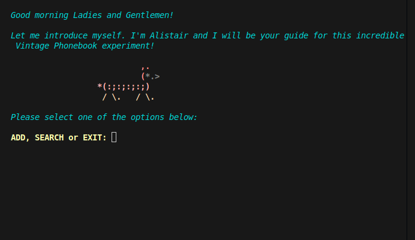

## CPP01/ex00 – Phone book

*A simple command-line contact manager implemented in C++, introducing classes, encapsulation, and basic I/O handling.*

**Languages & Tools:** C++98, Classes, I/O streams, std::string

**Skills:** Object-oriented design, encapsulation, input validation, data storage, formatted output

### Something interesting about this project ✨

Beginning of C++
Add some fun with colors and ASCII
small small data base

### 🖥️ Compilation & Usage

```bash
$> make
$> ./Phonebook
$> ...

```



*Part of the C++ module series at 42 Lausanne*


